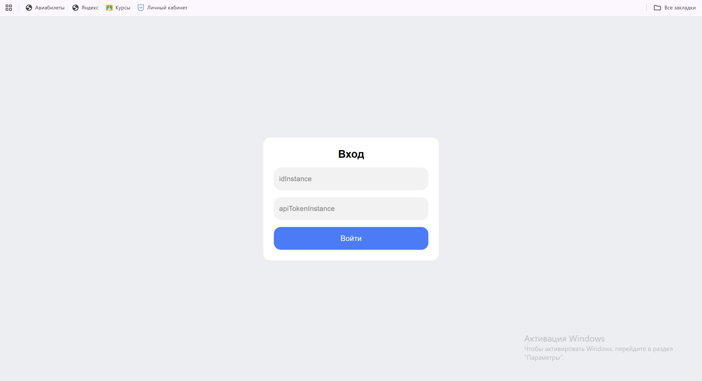
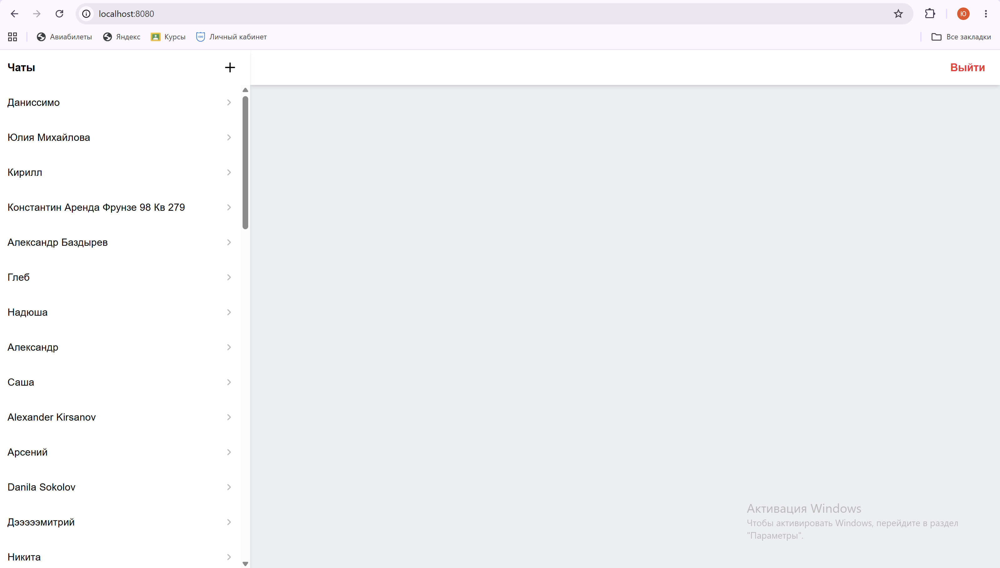
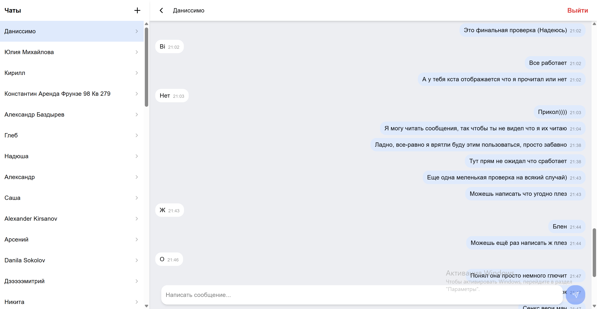
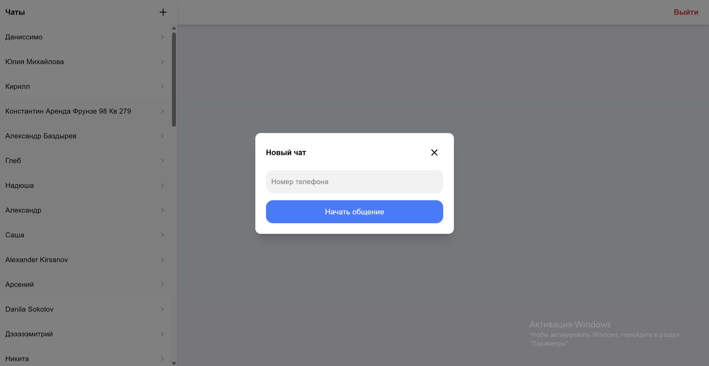

# Telegram Web Client

Веб-приложение для работы с Telegram через Green-API.

Проект позволяет авторизоваться с помощью `idInstance` и `apiTokenInstance`,
просматривать список чатов и вести переписку через HTTP API Green-API.

## Запуск

### Локально

Установить зависимости:

```bash
npm install
```

Запустить development-сервер:

```bash
npm run dev
```

### Docker

Собрать образ:

```bash
docker build -t test-green-api .
```

Запустить контейнер:

```bash
docker run -p 8080:80 whatsapp-web-client
```

После запуска приложение доступно по адресу:

```
http://localhost:8080
```

## Возможности

- Авторизация через `idInstance` и `apiTokenInstance`
- Проверка состояния инстанса
- Получение списка чатов
- Открытие отдельных чатов
- Получение истории сообщений
- Отправка сообщений
- Создание нового чата по номеру телефона
- Получение входящих сообщений через long polling
- Автоматическое обновление текущего чата при получении сообщения
- Адаптивный интерфейс для мобильных устройств

## Скриншоты

### Авторизация



### Список чатов



### Переписка



### Создание нового чата



## Стек

- React
- TypeScript
- React Router
- TanStack Query
- React Hook Form
- Zod
- Axios
- Tailwind CSS
- Max UI
- Docker
- Nginx